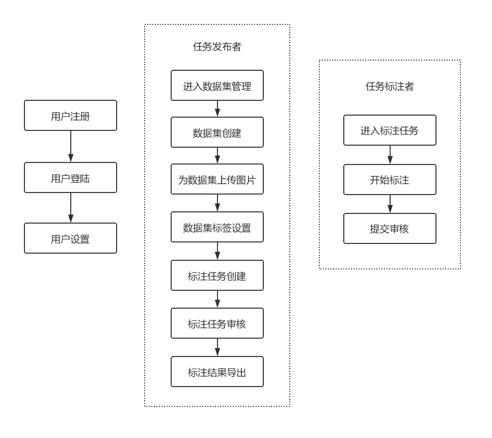

# 标注系统

## 1 系统框图

## 2 使用流程
每个人都有两种身份，一种为任务发布者，一种为标注者。任务发布者可以创建数据集，发布任务给其他人进行标注。标注者可以进入到标注任务中，在PC浏览器页面或手机微信小程序里进行标注（微信小程序中目前只能进行图片分类标注和图片上传任务）。

### 2.1 用户注册与设置
用户可以通过关注“晓图天下”微信公众号或者扫描别人分享的二维码注册该系统。二者的区别在于后者可以直接进入到相应的[群组](###-4.3-群组管理)中。
用户登陆，在PC浏览器中进入网站http://bz.hongeasy.com.cn/pclogin/login 扫描页面的二维码即可登陆。或者使用用户名密码登陆。
登陆后点击右上角的账号可以进行用户设置。
### 2.2 数据集管理
数据集即用户需要标注的图片集合。

用户登陆后可以创建新的[数据集](####-3.1.1-添加数据集)，然后为该数据集添加图片，可通过本地上传等方式将图片加入到该数据集中。图片上传完毕后，可以设置该数据集标注时所需要使用的标签名称。然后创建标注任务，分配给群组中的标注人员，标注人员可通过微信接收到标注任务信息。标注完毕后可以对标注结果进行审核，并将最终标注结果导出。
### 2.3 数据标注
对任务发布者发布的数据集进行标注。

数据标注分为四种不同类型，包括[分类标注](####-3.3.1-分类标注)（每张图片一个标签），[画框标注](####-3.3.2-画框标注)（用长方形框出图片中相应标签的物体），[多边形实例标注](####-3.3.3-多边形实例标注)（用多边形画出图片中相应标签的实例轮廓），[像素级实例标注](####-3.3.4-像素级实例标注)（通过交互式分割方法分别画出相应标签实例的前景和背景，系统自动分割出该实例的像素信息）。标注完毕后提交任务发布者审核。

## 3 详细流程
### 3.1 数据集管理
#### 3.1.1 添加数据集
（添加数据集流程界面截图）
##### 3.1.1.1 数据集信息 
（数据集信息界面截图）
##### 3.1.1.2 内容管理
- 图片上传

    图片有不同的上传方式

- 图片浏览与操作

    （图片分页浏览截图）

    图片选择

    图片删除
        
##### 3.1.1.3 标签管理
- 添加标签组
- 标签组管理
##### 3.1.1.4 任务管理
- 添加任务
- 任务信息查看
- 任务操作
    - 改变标签组
    - 统计信息
    - 数据导出
    - 删除

##### 3.1.1.5 审核管理
- 数据审核

#### 3.1.2 数据集分享

### 3.2 标注任务
#### 3.2.1 任务类型
#### 3.2.2 标签设置
#### 3.2.3 任务分配
- 微信通知

### 3.3 数据标注
#### 3.3.1 分类标注
该任务也可以在手机端通过微信公众号完成。
#### 3.3.2 画框标注
#### 3.3.3 多边形实例标注
#### 3.3.4 像素级实例标注

## 4 个人设置
### 4.1 用户登陆
用户可以通过扫描登陆界面的二维码登陆。（添加图片）

也可通过用户名密码登陆。（添加图片）
### 4.2 基本设置
在该界面可以看到用户的基本信息。（添加图片）

左侧上面部分为用户信息。（添加图片）左下部分为用户建议区域。（添加图片）
右侧为群组信息，描述用户属于哪一个群组中。（添加图片）
### 4.3 群组管理
每个人可以分属不同的群组，比如“浙江大学”组，“浙江工业大学”组等。

只有管理员权限者可以添加群组。

